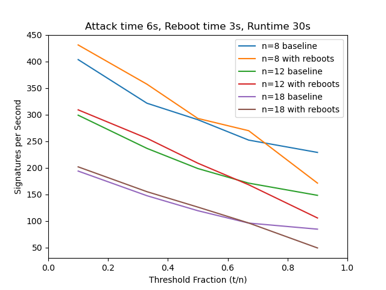

# Distributed Signatures with Threshold-Preserving Reboot Schedule

## How to Run

1. Install a recent version of Docker and `docker-compose`.
2. Execute `./main.py --build --run --plot`

## How it Works

A bunch of Docker containers start up on the same virtual network. One is the *initiator*, meaning that it generates and distributes key shares, then initiates all the distributed signature operations. The other nodes on the network are *responders*, meaning that they first receive a key share, then respond to signing request using that key.

This is a threshold cryptosystem, so any `t` out of `n` total nodes are needed to perform a signature (with `t <= n`). So long as `t < n`, there are some "extra" responders that are not needed to perform the signature. Therefore, the initiator only cares about the first `t` signature share responses, and discards the remaining. This also gives leeway to shut down and restart those extra `n-t` nodes, which can be helpful in the presence of an attacker that requires some minimum amount of time with access to a system to compromise it.

- The main code is in `server.py`, including the initiator and responder servers, and an extra server that the initiator uses at the very beginning to distribute keys. This is also the script that tracks performance statistics for a single run, communicating them through print statements that will show up in a log later.
- `bls.py` implements the cryptography that `server.py` uses. BLS stands for Boneh, Lynn, and Shacham, the authors of "Short Signatures from the Weil Pairing", published in the Journal of Cryptology in 2004.
- `reboot.py` is a general script that will start, kill, and restart some child process according to a calculated schedule to simulate hardware rebooting. In this case, `reboot.py` runs on the responder containers, starting and stopping individual responders.
- `main.py` runs on the host system to set up and tear down the container environment, extract runtime performance statistics from the container logs, and calculate & display the final performance statistics. It has three options: `--run` actually runs the tests, `--build` will first rebuild the containers with any changes to `server.py` or `restart.py`, and `--plot` will display plots of the performance data. Note that results are saved on each `--run` and loaded within the `--plot` code, so you can do `main.py --plot` to re-run statistics and plotting on the last execution, which can be very handy for iterating on data analysis and presentation.
- `Dockerfile` describes the how to create a container. It's used automatically with `main.py --build`. It's basically a script that gets run inside a template container to build and install dependencies, then copy in the required files from this repo.
- `docker-compose.yml` describes how to start up the containers on a virtual network. It's automatically used by `main.py --run`.